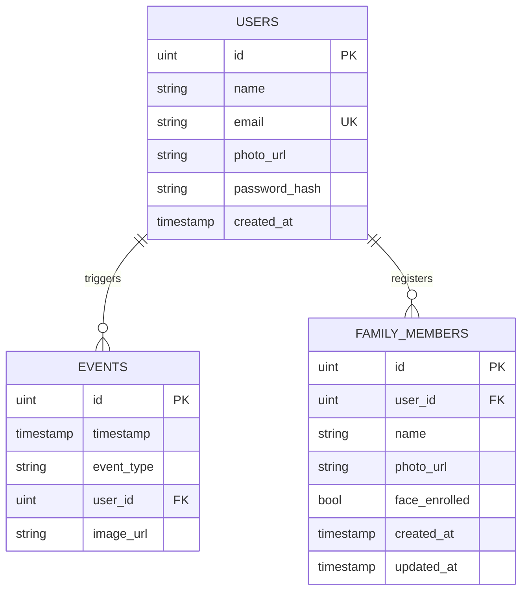

# Database Schema — Smart Door Security

> **ORM**: GORM (Go) · **Database**: PostgreSQL · **Auto-migration**: `db.AutoMigrate(&models.User{}, &models.Event{}, &models.FamilyMember{})`

---

## Entity Relationship Diagram

---

## Tables

### `users`

| Column          | Type        | Constraints              | JSON Key       | Notes                           |
|-----------------|-------------|--------------------------|----------------|---------------------------------|
| `id`            | `uint`      | `PRIMARY KEY`            | `id`           | Auto-increment                  |
| `name`          | `string`    |                          | `name`         |                                 |
| `email`         | `string`    | `UNIQUE`                 | `email`        |                                 |
| `photo_url`     | `string`    |                          | `photo_url`    | Profile photo (Cloudinary URL)  |
| `password_hash` | `string`    |                          | *(hidden)*     | Excluded from JSON via `json:"-"` |
| `created_at`    | `timestamp` | `DEFAULT CURRENT_TIMESTAMP` | `created_at` |                                 |

**Source**: [`user.go`](file:///c:/Users/Dipankar%20Ghosh/Coding/smart-door-security/backend/internal/models/user.go)

---

### `events`

| Column       | Type        | Constraints   | JSON Key     | Notes                          |
|--------------|-------------|---------------|--------------|--------------------------------|
| `id`         | `uint`      | `PRIMARY KEY` | `id`         | Auto-increment                 |
| `timestamp`  | `timestamp` |               | `timestamp`  | Time the event occurred        |
| `event_type` | `string`    |               | `event_type` | One of the event type constants |
| `user_id`    | `uint`      | `NOT NULL`, `FOREIGN KEY → users(id)` | `user_id` | Every event is automatically attributed to the active owner session |
| `image_url`  | `string`    |               | `image_url`  | Snapshot image (Cloudinary URL) |

#### Event Type Constants

| Constant               | Value                  | Description                        |
|------------------------|------------------------|------------------------------------|
| `EventAuthorizedEntry`    | `AUTHORIZED_ENTRY`    | Recognized family member entered   |
| `EventUnknownVisitor`     | `UNKNOWN_VISITOR`     | Unrecognized face detected         |
| `EventForcedEntry`        | `FORCED_ENTRY`        | Door forced open without auth      |
| `EventIntrusionCleared`   | `INTRUSION_CLEARED`   | Intrusion state manually or automatically cleared |
| `EventManualUnlock`       | `MANUAL_UNLOCK`       | Door unlocked manually via app     |
| `EventSpoofAttempt`       | `SPOOF_ATTEMPT`       | Spoofing / liveness check failure  |
| `EventDoorOpened`         | `DOOR_OPENED`         | Door physically opened             |
| `EventDoorClosed`         | `DOOR_CLOSED`         | Door physically closed             |
| `EventDoorLeftOpen`       | `DOOR_LEFT_OPEN`      | Door left open for extended period |
| `EventVisitorApproaching` | `VISITOR_APPROACHING` | Motion / visitor detected at door  |
| `EventHandleTamper`       | `HANDLE_TAMPER`       | Handle tamper sensor triggered     |
| `EventMotorTamper`        | `MOTOR_TAMPER`        | Motor tamper sensor triggered      |

**Source**: [`event.go`](file:///c:/Users/Dipankar%20Ghosh/Coding/smart-door-security/backend/internal/models/event.go)

---

### `family_members`

| Column          | Type        | Constraints                                     | JSON Key        | Notes                              |
|-----------------|-------------|--------------------------------------------------|-----------------|------------------------------------|
| `id`            | `uint`      | `PRIMARY KEY`                                    | `id`            | Auto-increment                     |
| `user_id`       | `uint`      | `FOREIGN KEY → users(id)`                        | `user_id`       | Owner of this family member record |
| `name`          | `string`    | `NOT NULL`, `UNIQUE INDEX (user_id, name)`       | `name`          | Unique per user                    |
| `photo_url`     | `string`    |                                                  | `photo_url`     | Enrollment photo (Cloudinary URL)  |
| `face_enrolled` | `bool`      | `DEFAULT false`                                  | `face_enrolled` | Whether face embedding exists      |
| `created_at`    | `timestamp` |                                                  | `created_at`    |                                    |
| `updated_at`    | `timestamp` |                                                  | `updated_at`    |                                    |

**Source**: [`family_member.go`](file:///c:/Users/Dipankar%20Ghosh/Coding/smart-door-security/backend/internal/models/family_member.go)

---

## Placeholder Models (Empty)

The following model files exist but contain no struct definitions yet:

| File               | Intended Purpose          |
|--------------------|---------------------------|
| `device.go`        | IoT device registration   |
| `access_log.go`    | Door access audit logging |
| `intrusion.go`     | Intrusion event details   |

---

## Migration Script

The initial SQL migration is at [`migrate.sql`](file:///c:/Users/Dipankar%20Ghosh/Coding/smart-door-security/backend/scripts/migrate.sql).

> [!NOTE]
> The SQL migration only defines `users` and `family_members`. The `events` table and additional columns (e.g. `photo_url`, `face_enrolled`) are managed by GORM's `AutoMigrate`, which applies schema changes at application startup.
